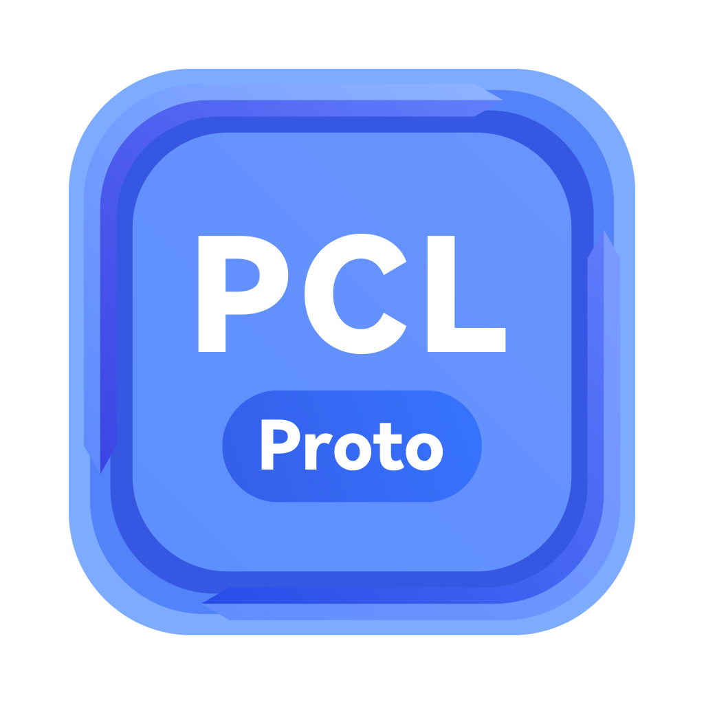
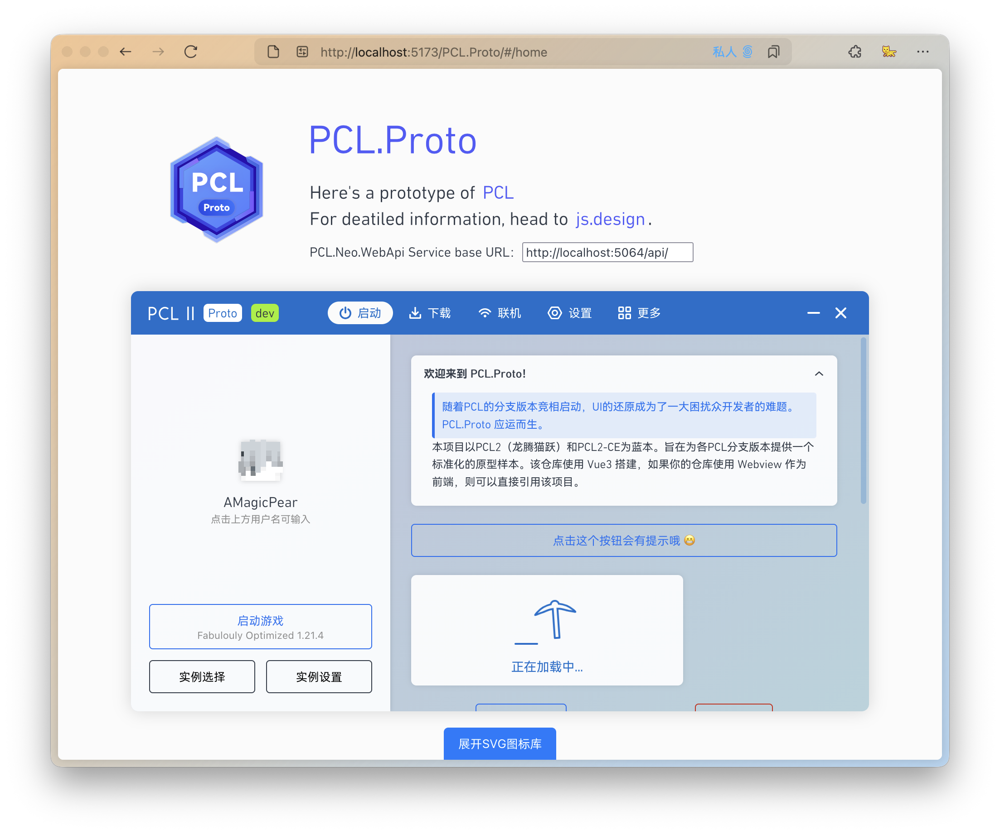

# PCL.Proto

| [中文版点我](./README-CN.md) |

<p align="center">
  
</p>

With the rapid launch of PCL branch versions, UI restoration has become a major challenge for many developers. PCL.Proto emerges as a solution.



This project is modeled after [PCL2](https://github.com/Hex-Dragon/PCL2) and [PCL2-CE](https://github.com/PCL-Community/PCL2-CE), with a goal of providing a standardized prototype sample for each PCL branch version. The repository is built using Vue3, and if your project uses Webview as the frontend, you can directly reference this project.

The project is also ready for preview at [PCL.Proto](https://amagicpear.top/PCL.Proto/).

## Prototype

If your PCL branch version or your custom launcher is not based on Web technology, referencing this repository directly might have limited convenience. You may head to [js.design - 「PCL.Prototype」](https://js.design/f/QVPQRY?p=zX2rcVk6Cy&mode=design) to view the specific application prototype, export the cut image or refer to the style code generated by it.

In case you would like to modify the prototype design file, you are welcome to [click this link](https://js.design/ti?c=tS-6qs0WDQJ3H4) to join the team.

## Project Configuration

### Prerequisites

- First, please ensure that `nodejs` or `bun` is installed on your device. If you use `bun` as the package manager, you can replace all `pnpm` commands below with `bun`.
- The device should have a usable rust toolchain installed. 

### Platform Specific
- Windows: the MSVC version of the toolchain is required. Additionally, ensure that you have installed the MSVC suite from the C++ development tools and the Windows SDK in the Visual Studio Installer. You also need to download and configure the [Npcap SDK](https://npcap.com/#download).
- macOS: make sure that Xcode is installed. You also need to install protobuf via Homebrew (`brew install protobuf`).
- Ubuntu: you need to install the following packages: `libwebkit2gtk-4.0-dev libwebkit2gtk-4.1-dev libappindicator3-dev librsvg2-dev patchelf protobuf-compiler`.

> [!NOTE]
> If you have any questions, please refer to [Prerequisites | Tauri](https://tauri.app/start/prerequisites/).

### Project Dependencies

After cloning this project, you need to run the following command to initialize the submodule:

```sh
git submodule update --init --recursive
```

Currently, the project is a Tauri + Vue3 + Vite project. Before running the project for the first time, please run the following command to install the front-end dependencies:

```sh
pnpm install
```

The backend dependencies will be managed by `cargo` automatically.

Then, use `pnpm run tauri icon` to automatically generate icons. You can then start the development and build processes.

> [!WARNING]
> The icons in this repository are excluded. Therefore, if you do not perform this step after cloning the repository, the `icons` folder will be empty, and the Tauri application will throw an error when it starts!

### Hot Reload Development

```sh
pnpm dev
```

### Build Tauri App

If only `bun` is installed on your device but `nodejs` is not installed, please change the`build/foreBuildCommand` content in `src-auri/tauri.conf.json `from `pnpm run build` to `bun run build-only`.

## HELP WANTED!!

I want to make this project into a Vue component npm package, but I don't know how to do it. If there are any experts who can do component libraries, please contact me! Thank you!

## Credits

> If I have seen further it is by standing on ye shoulder of Giants.
> —— Sir Isaac Newton

### Directed referenced projects
- [Vue.js](https://github.com/vuejs/core)
- [TypeScript](https://github.com/microsoft/TypeScript)
- [Pug](https://github.com/pugjs/pug)
- [Vite](https://github.com/vitejs/vite)
- [Vue Router](https://github.com/vuejs/vue-router-next)
- [xml-js](https://www.npmjs.com/package/xml-js)
- [Pinia](https://pinia.vuejs.org/)
- [skinview3d](https://github.com/bs-community/skinview3d)
- [Bun](https://bun.com/)
- [Rust Programming Language](https://www.rust-lang.org/)
- [Tauri](https://tauri.app/)
- [Terracotta](https://github.com/burningtnt/Terracotta)

### Implementation or design reference
- [Plain Craft Launcher](https://github.com/Meloong-Git/PCL)
- [PCL2-CE](https://github.com/PCL-Community/PCL2-CE)
- [PCL.Neo](https://github.com/PCL-Community/PCL.Neo)
- [xphost008/MMCLL](https://github.com/xphost008/MMCLL)
- [Steve-xmh/scl](https://github.com/Steve-xmh/scl)
